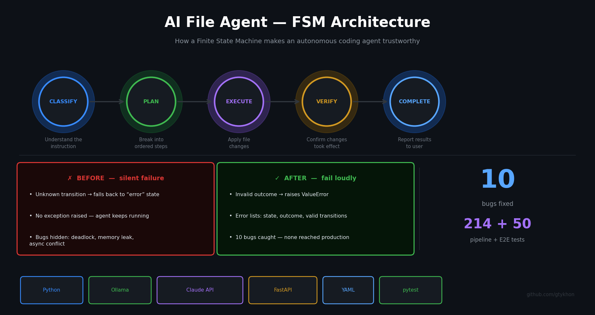

# Simple File Agent



A minimal, self-hostable agentic coding assistant that performs file operations via natural language.

Runs locally with [Ollama](https://ollama.com) and falls back to Anthropic Claude when needed.

---

## How it works

Every instruction moves through a **Finite State Machine**:

```
classify → plan → execute → verify → complete
```

A Finite State Machine (FSM) is a system that can only exist in one defined state at a time, with explicit rules for moving between them. For an autonomous agent that touches real files, this matters: the agent can't skip states, can't drift, and raises an error loudly if something unexpected happens — no silent failures.

The workflow is defined in [`workflows/code_operation.yaml`](workflows/code_operation.yaml), making it easy to inspect and modify.

---

## Architecture

```
simple-file-agent/
├── agent/
│   ├── fsm.py           # FSM engine — state tracking, transition validation
│   ├── llm_client.py    # Multi-model client — Ollama (local) + Claude (fallback)
│   ├── file_ops.py      # File operations — read/write/edit/delete/list
│   ├── quality_gate.py  # Two-stage quality gate — generate → review → retry
│   └── runner.py        # Agent runner — drives the FSM through one instruction
├── workflows/
│   └── code_operation.yaml  # Workflow graph (YAML)
└── main.py              # CLI entry point
```

### Multi-model LLM client

Uses **Ollama** (local, free) by default. Automatically falls back to **Anthropic Claude** on:
- Ollama not running
- Connection error
- Rate limit (HTTP 429) — 1-hour cooldown before retrying Ollama

### Quality gate

Code generation runs through a two-stage pipeline:

1. **Generate** — fast model produces code
2. **Review** — cloud model scores it across 5 axes (syntax, logic, error handling, best practices, security)

If rejected, the feedback is appended to the generation prompt and it retries (configurable, default 2 attempts).

### Safety

All file operations are sandboxed to `AGENT_WORKSPACE`. Any path that resolves outside the workspace raises `PermissionError` — no path traversal.

---

## Quickstart

**1. Install dependencies**
```bash
pip install -r requirements.txt
```

**2. Configure**
```bash
cp .env.example .env
# Add your ANTHROPIC_API_KEY
```

**3. (Optional) Start Ollama**
```bash
ollama serve
ollama pull llama3.1
```
If Ollama isn't running, the agent falls back to Claude automatically.

**4. Run**
```bash
# Single instruction
python main.py "write a Python function that reverses a string to utils.py"
python main.py "read utils.py"
python main.py "list ."

# Interactive REPL
python main.py --interactive

# Restrict to a specific workspace directory
python main.py --workspace ./my_project "add a docstring to main.py"
```

---

## Example output

```
>>> write a function that checks if a number is prime to math_utils.py
✅  Generated and saved to 'math_utils.py' (quality score: 0.87, approved: True)

>>> read math_utils.py
✅  def is_prime(n: int) -> bool:
    ...

>>> edit math_utils.py
✅  Edited math_utils.py
```

---

## Configuration

| Environment variable | Default | Description |
|---|---|---|
| `ANTHROPIC_API_KEY` | — | Required for Claude fallback and quality gate reviews |
| `OLLAMA_MODEL` | `llama3.1` | Local Ollama model |
| `CLAUDE_MODEL` | `claude-haiku-4-5-20251001` | Cloud fallback model |
| `AGENT_WORKSPACE` | `.` | Root directory the agent can read/write |
| `LOG_LEVEL` | `INFO` | `DEBUG` for verbose FSM trace logs |

---

## Why FSM over a free-form agent loop?

Free-form agents are harder to debug — they can end up in undefined states with no clear recovery path. An FSM gives you:

- **Predictable behaviour** — you always know what state the agent is in
- **Explicit failure** — invalid transitions raise errors immediately, not silently
- **Debuggability** — the full transition history is available after every run
- **Extensibility** — add new states/transitions by editing the YAML

This is a simplified version of the FSM used in [ai-file-agent](https://github.com/gtykhon/ai-file-agent).

---

## License

MIT
